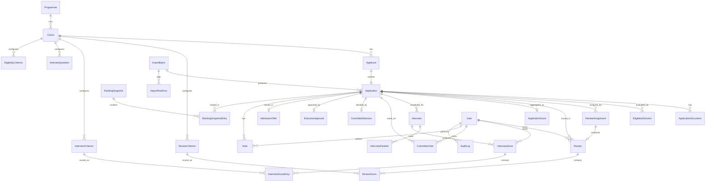

# PAM-P FMS — Database Design (Version 1.0)

This is the complete data foundation for V1.0, covering every business
process approved so far: applicant import, automatic eligibility
screening, blind dual review with automatic third-reviewer resolution,
four-panelist interviews, committee voting, executive approval,
admissions, notes, ranking, and audit. It extends (does not replace) the
Phase 0 / Sequence 1 schema already running in production-shaped form.

Source of truth: [`prisma/schema.prisma`](../prisma/schema.prisma). This
document explains and justifies it — if the two ever disagree, the
schema file is correct and this doc is stale.

No UI changes accompany this migration. Per the review, application
modules (Reviewer Workspace, Interview Workspace, Committee, Executive
Approval, Admissions) are built against this schema in later sequences,
after review.

**Phase 3A update** (`20260719120000_phase3a_review_framework`): the
original `ReviewCriterion`/`Review`/`ReviewScore` design below described
in this document predates the review-framework/scoring-engine work — at
the time this document was written, "scoring is relational, never JSON"
was the requirement, but there was no configurable, versioned framework
concept yet (`ReviewCriterion` was a flat, cohort-scoped list). Phase 3A
added `ReviewStage` and `ReviewFramework` (versioned, `DRAFT`/
`PUBLISHED`/`RETIRED`) above `ReviewCriterion`, and `RatingScale`/
`RatingScaleBand` alongside it; `ReviewCriterion` moved from
`cohortId`-scoped to `reviewFrameworkId`-scoped, gaining `code`,
`minScore`, guidance fields, and mandatory/decimal-policy flags; `Review`
gained `reviewFrameworkId` (pinning the exact rubric version scored
against) and reopening fields, and its `status` moved from the shared
`ScoreSubmissionStatus` enum (still used by `InterviewScore`, untouched)
to a new, richer `ReviewStatus` enum. `review_criteria`, `reviews`, and
`review_scores` were all empty at the time (the Reviewer Workspace was
never built), so this was a clean structural change, not a data
migration. Full design rationale, including why `ReviewStage` has no
`deletedAt`, in [`docs/REVIEW_FRAMEWORK.md`](REVIEW_FRAMEWORK.md); the
scoring/lifecycle rules built on top of it are in
[`docs/SCORING_ENGINE.md`](SCORING_ENGINE.md) and
[`docs/REVIEW_LIFECYCLE.md`](REVIEW_LIFECYCLE.md). The ERD and table
descriptions below are otherwise unchanged and still accurate for every
other entity.

---

## 1. Entity Relationship Diagram

*(A second, denser diagram — auth/RBAC/audit/config tables — is
unchanged from Phase 0 and omitted here; see `docs/architecture.md`.)*

---

## 2. Entity Descriptions

| Entity | What it represents |
|---|---|
| `Programme` | A fellowship programme. One row today ("PAM-P"); exists so a second programme is a new row, not a migration touching every table beneath it. |
| `Cohort` | One programme cycle ("PAM-P 2026"). Every applicant-facing table hangs off a cohort. |
| `Applicant` | Bio data for one person, imported from the portal export. |
| `Application` | That person's submission for a cohort: pipeline stage, eligibility outcome, essay/extra data. |
| `ApplicationDocument` | A pointer to an uploaded file (CV, transcript, ID) — storage-provider-agnostic. |
| `ImportBatch` / `ImportRowError` | Provenance for every import run and every row that failed, with why. |
| `EligibilityCriterion` / `EligibilityDecision` | Admin-configured automatic screening rule, and the per-application verdict it produced. |
| `ReviewAssignment` | Routing: who (which reviewer, which slot) is responsible for scoring an application. |
| `ReviewCriterion` / `Review` / `ReviewScore` | The scoring rubric, one reviewer's submission, and the per-criterion scores inside it. |
| `ApplicationScore` | The single computed/cached "current standing" for an application — reviewer average, interview average, composite score, rank. |
| `RankingSnapshot` / `RankingSnapshotEntry` | An immutable, named, sized, lockable ranking taken at a point in time (e.g. "Interview Shortlist," size 70, or "Final Ranking," Addendum Modules 4-5). |
| `RankingTieResolution` / `RankingTieResolutionApplication` | A Level 3 tie (Addendum Module 5) — two or more applications identical on interview score, review score, and composite score — and the Selection Committee's recorded resolution. |
| `InterviewCriterion` / `InterviewQuestion` | Configurable interview rubric and question bank. |
| `Interview` / `InterviewPanelist` / `InterviewScore` / `InterviewScoreEntry` | A scheduled interview, its four panelists, and each panelist's independent score. |
| `CommitteeVote` / `CommitteeDecision` | Individual committee member votes, and the recorded final outcome. |
| `ExecutiveApproval` | The Executive's Approve/Return/Request-Clarification decision. |
| `AdmissionOffer` | Offer status and onboarding checklist for an admitted fellow. |
| `Note` | Role-scoped commentary on an application. |
| `AuditLog` | Immutable record of every security- and business-relevant event. |
| `SystemSetting` | Admin-tunable operational parameters (thresholds, target sizes) as key/value, not hardcoded. |
| `Notification` | In-app operational notification. |
| `User` / `Account` / `Session` / `VerificationToken` | Staff identity and Auth.js session state (unchanged from Phase 0). |

---

## 3. Table Definitions, Keys, Relationships

Full column-level definitions are in `prisma/schema.prisma` — reproducing
every column here would just be a second copy that drifts. This section
covers what a raw column list doesn't: *why* the relationships are
shaped the way they are.

### Applicant / Application split

Kept as two tables (not one) because they represent different things
that can evolve independently: `Applicant` is the person (stable,
survives across cohorts if PAM-P ever lets someone reapply), `Application`
is one submission (pipeline state, changes constantly). `applicantId` is
`@unique` on `Application`, making it a strict 1:1 in V1.0 — modeled as
two tables anyway rather than one wide table, because collapsing them
now would make "can a person apply to two cohorts" a schema change
later instead of dropping the `@unique`.

### Denormalized scoping FKs

`Application.cohortId`, `Review.applicationId`/`reviewerId`,
`Interview.cohortId`, `ApplicationScore.cohortId` — each of these is
derivable via a join through a parent (`Applicant.cohortId`,
`ReviewAssignment`, `Application.cohortId`) but is stored directly
anyway. This is intentional, consistent denormalization for hot-path
queries ("all applications in this cohort," "my assigned reviews," "this
cohort's interview calendar") that would otherwise need an extra join on
every request. It's written once, at creation time, in the same
transaction as the authoritative parent — never independently updated —
so there's no drift risk in exchange for the query-performance win.

### Routing vs. scoring: `ReviewAssignment` vs. `Review`

Two tables, not one, because they answer different questions.
`ReviewAssignment` answers "who is responsible for this" — it's created
the moment auto-assignment runs, before any scoring happens, and is what
blind-review enforcement reads to know who is *allowed* to see a given
`Review`. `Review` is the actual work product — it may sit in `DRAFT` for
days. `Review.reviewAssignmentId` is a required, unique 1:1 FK back to
its assignment.

**Phase 3B** gave `ReviewAssignment` its own status lifecycle
(`AssignmentStatus`, mirroring `Review`'s but tracking *routing* state —
assigned/accepted/escalated/reassigned/cancelled — independently of
`Review`'s *scoring* state) and dropped its
`@@unique([applicationId, slot])` in favor of a partial unique index, so
reassignment (§10) can preserve history instead of overwriting it — see
[`docs/REVIEW_ASSIGNMENT_ENGINE.md`](REVIEW_ASSIGNMENT_ENGINE.md) and
[ADR-0008](adr/ADR-0008-third-review-divergence-and-reassignment-history.md).
Three new tables round out the assignment engine: `ReviewerCapacity`
(per-reviewer, per-programme max concurrent load and availability),
`ReviewConflictOfInterest` (pre-assignment exclusion — distinct from
`Review.conflictOfInterest`, which is a post-assignment recusal flag on
the review itself), and `ReviewEscalation` (one row per detected
Reviewer-1/Reviewer-2 divergence, linking to the auto-assigned `THIRD`
`ReviewAssignment` and recording the resolved final score).

### Scoring is relational, never JSON

Every score — `ReviewScore`, `InterviewScoreEntry` — is one row per
(submission, criterion), not a JSON blob on the parent. This is a hard
requirement from the brief and it's the only way `AVG()`, `RANK()`, and
reporting queries stay SQL aggregates instead of application-layer JSON
parsing at read time. `InterviewCriterion` is admin-configurable (label,
max score, weight, order, active flag) so its rubric changes without a
deploy; `ReviewCriterion` is the same idea, generalized further in Phase
3A into a full versioned framework (`ReviewFramework`) rather than a
flat per-cohort list — see
[`docs/REVIEW_FRAMEWORK.md`](REVIEW_FRAMEWORK.md).

### `ApplicationScore`: the aggregation cache

Written only by `ScoreAggregationService` (Sequence 3), read by every
dashboard, list, and report. Separate from `Application` rather than
columns on it, because it's rewritten every time a score changes while
`Application` is comparatively stable — this keeps write churn and
change-history scoped to what's actually volatile, and means a dashboard
query never has to recompute an average across `ReviewScore` rows on
every page load.

### `RankingSnapshot`: generalized Top 70 / Top 60

Modeled as a named, sized, timestamped, lockable snapshot
(`RankingSnapshot { name, targetSize, isLocked, generatedAt }`) rather
than two tables literally called `Top70`/`Top60`. The numbers 70 and 60
are this cohort's policy, not permanent structure — a generic mechanism
that can produce "Interview Shortlist, size 70" one year and a
differently-sized list the next, without a schema change, does the same
job the brief asked for (`ranking.top70Size`/`ranking.top60Size` in
`SystemSetting` hold the actual configured numbers) while staying correct
if those numbers ever change. Once `isLocked = true`, a snapshot's
`RankingSnapshotEntry` rows are the permanent historical record of "who
was ranked where, on what date" — regardless of any later
`ApplicationScore` recalculation. **Flagging this explicitly since the
brief named "Top 70"/"Top 60" specifically — if literal, dedicated
`Top70List`/`Top60List` tables are wanted instead of this generalized
form, that's a small schema change, easy to make now, before any service
code reads from this shape.**

### Interviews: four fixed panelists

`InterviewPanelist` seats a `User` on an `Interview`; the "exactly four"
rule is a business invariant enforced in the application layer
(`modules/interviews`, Sequence 3), not the database. Postgres/Prisma
can't express "exactly 4 child rows" declaratively without a trigger, and
a trigger is more operational surface (migration risk, harder to debug,
another thing that can silently break) than this needs — the same
judgment call already applied to "exactly two/three reviewers," enforced
in `modules/reviews/services/assignmentService.ts` (Phase 3B; originally
`modules/reviews/assignment.ts` in Sequence 1, refactored into the
assignment engine rather than left as a separate module), not SQL.

### Committee vote vs. decision

`CommitteeVote` is one row per member per application (what they
individually cast). `CommitteeDecision` is one row per application (what
was recorded as final — by a chair, or by a rule the aggregation service
applies). Separating them preserves the individual votes as a permanent
record even though only the aggregate decision drives the pipeline
forward.

### Executive Approval read/write split

`ExecutiveApproval` has one FK to `User` (`approverId`) and no separate
"viewer" concept in the schema — visibility is an RBAC concern, not a
data-model one. Programme Secretary's "global read, never approves"
requirement is enforced by the permission catalogue
(`lib/permissions/catalog.ts`'s `EXECUTIVE_VIEW` vs. `EXECUTIVE_APPROVE`
— see [`docs/RBAC.md`](RBAC.md)), not by a second table.

---

## 4. Primary & Foreign Keys

Every table uses a `cuid()` string primary key (`id`), consistent with
Phase 0/Sequence 1 — sortable-ish, collision-safe without a central
sequence, and doesn't leak row counts the way a serial integer would in
URLs (`/applicants/[id]`).

Foreign key `onDelete` behavior, by category:

| Relationship | Behavior | Why |
|---|---|---|
| Child records of an `Application` (documents, decisions, reviews, votes, notes, ranking entries, etc.) | `Cascade` | Deleting an application (rare — see soft-delete strategy below; this is the safety net if it ever genuinely happens) should not leave orphaned scoring/decision rows. |
| `User` referenced as an actor (`AuditLog.actorId`, `SystemSetting.updatedById`) | `SetNull` | Removing a staff account must never delete the historical record of what they did — the event stays, attributed to "System" instead of a name. |
| `User` referenced as a required participant (`Review.reviewerId`, `CommitteeVote.committeeMemberId`, etc.) | Restrict (default) | A user who has live assignments/scores can't be hard-deleted out from under them — deactivate (`isActive = false`) instead; hard delete only after reassignment. |
| `Applicant.cohortId`, `Application.cohortId`, criterion tables' `cohortId` | Restrict (default) | A cohort with data in it shouldn't be deletable by accident. |

---

## 5. Indexing Strategy

Three tiers:

**1. Uniqueness (correctness, not performance)** — see §6.

**2. Foreign-key and filter indexes** — every FK used in a `WHERE` gets an
index; the pattern throughout is `@@index([cohortId, <hot filter>])`
(e.g. `Application: [cohortId, stage]`, `[cohortId, eligibilityStatus]`,
`[cohortId, createdAt]`; `ApplicationScore: [cohortId, rank]`,
`[cohortId, compositeScore]`; `Interview: [cohortId, scheduledAt]`) so
the two things every list screen filters by — "this cohort" plus one
more dimension — are answered by a single index, not a full scan
filtered in application code. `Review: [reviewerId, status]` is what
makes "my assigned queue" fast without scanning every review in the
cohort.

**3. Text search** — a plain B-tree index doesn't help
`ILIKE '%chinaza%'`. `pg_trgm` GIN indexes on
`Applicant.firstName/lastName/email/institution` (migration
`20260718184500_search_indexes`) are what keep the Applicants search bar
fast at 5,000+ rows instead of degrading linearly. This is the one piece
of this design that isn't expressible in `schema.prisma`'s declarative
`@@index` — it's a hand-written raw-SQL migration alongside the
generated ones, which Prisma fully supports (`prisma/migrations/` can mix
both).

At current scale (600, soon 5,000 rows) none of this is *required* for
acceptable performance — Postgres handles that volume fine unindexed for
a while. It's here because "5,000+ applicants, multiple cohorts, multiple
programmes" was stated as a design target, and adding indexes now is
free; adding them retroactively under production load, after a slow
query is already hurting reviewers mid-cycle, is not.

---

## 6. Unique Constraints

| Table | Constraint | Business rule it enforces |
|---|---|---|
| `Programme` | `slug` | One programme per identifier |
| `Applicant` | `(cohortId, email)`, `(cohortId, externalRef)` | No duplicate person within a cohort, matchable by either key — this is what makes import idempotent |
| `Application` | `applicantId` | One application per applicant (1:1) |
| `ReviewAssignment` | `(applicationId, slot)` | An application has at most one FIRST, one SECOND, one THIRD reviewer |
| `Review` | `reviewAssignmentId` | One review per assignment (1:1) |
| `ReviewScore` | `(reviewId, criterionId)` | A reviewer scores each rubric item once per review |
| `InterviewPanelist` | `(interviewId, userId)` | A panelist seats once per interview |
| `InterviewScore` | `(interviewId, panelistId)` | One score submission per panelist per interview |
| `InterviewScoreEntry` | `(interviewScoreId, criterionId)` | A panelist scores each rubric item once |
| `CommitteeVote` | `(applicationId, committeeMemberId)` | One vote per member per application |
| `CommitteeDecision`, `ExecutiveApproval`, `AdmissionOffer`, `ApplicationScore` | `applicationId` | Exactly one of each per application |
| `RankingSnapshotEntry` | `(rankingSnapshotId, applicationId)` | An application appears once per snapshot |
| `User` | `email` | Login identity |
| `Account` | `(provider, providerAccountId)` | Auth.js requirement |
| `Session` | `sessionToken` | Auth.js requirement |

---

## 7. Enum Definitions

| Enum | Values | Used by |
|---|---|---|
| `Role` | `SYSTEM_ADMIN, PROGRAMME_DIRECTOR, PROGRAMME_SECRETARY, ELIGIBILITY_REVIEWER, APPLICATION_REVIEWER, INTERVIEWER, SELECTION_COMMITTEE_MEMBER, EXECUTIVE, FELLOW` (Phase 3B.1: `REVIEWER` split into `ELIGIBILITY_REVIEWER`/`APPLICATION_REVIEWER` — see [`docs/ROLE_AND_NAVIGATION_RECONCILIATION.md`](ROLE_AND_NAVIGATION_RECONCILIATION.md)) | `User` |
| `ApplicationStage` | `IMPORTED, UNDER_REVIEW, INTERVIEW, COMMITTEE_REVIEW, EXECUTIVE_APPROVAL, ADMISSIONS, CLOSED` | `Application` |
| `EligibilityStatus` | `PENDING, ELIGIBLE, INELIGIBLE` | `Application` |
| `ImportBatchStatus` | `PROCESSING, COMPLETED, FAILED` | `ImportBatch` |
| `CriterionOperator` | `EQUALS, NOT_EQUALS, GREATER_THAN_OR_EQUAL, LESS_THAN_OR_EQUAL, IN, EXISTS, REGEX` | `EligibilityCriterion` |
| `ReviewSlot` | `FIRST, SECOND, THIRD` | `ReviewAssignment` |
| `AssignmentMethod` | `AUTO, MANUAL` | `ReviewAssignment` |
| `ScoreSubmissionStatus` | `DRAFT, SUBMITTED, RECUSED` | `Review`, `InterviewScore` |
| `RankingTier` | `TOP_70, TOP_60, RESERVE, NOT_RANKED` | `ApplicationScore` — unused; see [ADR-0020](adr/ADR-0020-final-ranking-tier-resolution.md) |
| `InterviewStatus` | `SCHEDULED, COMPLETED, CANCELLED, NO_SHOW` | `Interview` |
| `TieResolutionStatus` | `PENDING, RESOLVED` | `RankingTieResolution` |
| `SelectionOutcome` | `SELECTED, RESERVE, REJECTED` | `CommitteeVote`, `CommitteeDecision` — reserved for Module 6, still unused |
| `ExecutiveDecision` | `APPROVED, RETURNED, CLARIFICATION_REQUESTED` | `ExecutiveApproval` |
| `AdmissionOfferStatus` | `PENDING, SENT, ACCEPTED, DECLINED, EXPIRED` | `AdmissionOffer` |
| `NoteVisibility` | `REVIEWER, INTERVIEWER, COMMITTEE, EXECUTIVE, ALL_STAFF` | `Note` |

`SelectionOutcome` is deliberately shared between `CommitteeVote` and
`CommitteeDecision` — a member's recommendation and the final decision
are the same *kind* of value, so one enum instead of two that would
drift. `ScoreSubmissionStatus` is shared between `Review` and
`InterviewScore` for the same reason; `RECUSED` isn't used by
`InterviewScore` yet in V1.0 but the value is available if panel recusal
becomes a requirement, at zero schema cost.

---

## 8. Audit Strategy

One table, `AuditLog`, is the entire audit trail — not a supplement to
per-entity history columns. Every business-relevant event (see the
taxonomy in `lib/audit/actions.ts`, extended this round with
`REVIEW_SUBMITTED`, `REVIEW_THIRD_REVIEWER_ASSIGNED`,
`INTERVIEW_SCHEDULED`, `INTERVIEW_SCORE_SUBMITTED`,
`COMMITTEE_VOTE_CAST`, `COMMITTEE_DECISION_RECORDED`,
`EXECUTIVE_APPROVAL_DECIDED`, `ADMISSION_OFFER_ISSUED`/`_STATUS_CHANGED`,
alongside the existing login/import/eligibility/user-management actions)
writes one row: `actorId` (nullable + `SetNull` — system-triggered events
like auto-assignment have no human actor), `action`, `entityType`,
`entityId`, `metadata` (JSON — field-level changes always follow a
`{from, to}` convention, established in Sequence 1 and continued here),
`ipAddress`, and — new this round — `userAgent`, for basic security
forensics on login events.

Rows are never updated or deleted. Status Tracking and Decision History
screens (Sequence 3+) are filtered *views* over this one table, not a
separate history mechanism — this is what "single validated data source"
means applied to auditability, not just to KPIs.

**Not implemented**: Postgres Row-Level Security. RLS would give
defense-in-depth for blind review (the database itself refusing to
return another reviewer's row, not just the application layer choosing
not to ask for it), but Prisma's connection pooling uses one DB role, so
real per-user RLS needs a `SET LOCAL` session variable set on every
request inside every transaction — meaningful added complexity for a
V1.0 timeline where the application-layer enforcement (every repository
query scoped to `session.user.id`, established in Sequence 1 and
continued through Review/InterviewScore) already meets the stated
requirement ("enforced in the interface and server-side"). Worth
revisiting if this schema ever serves more than one application layer
that could bypass Prisma's repositories.

---

## 9. Soft Delete Strategy

`deletedAt DateTime?` — nullable, `NULL` means active — on exactly the
tables where losing a record would lose something worth keeping, and
nowhere else:

| Has `deletedAt` | Why |
|---|---|
| `Applicant`, `Application` | Audit/compliance value persists even for a rejected, withdrawn, or mistakenly-imported record; recoverable rather than gone. |
| `User` | Genuine account removal (duplicate/mistaken account) should be reversible; day-to-day suspension already uses `isActive` and isn't affected by this. |
| `Note` | The one place a user might legitimately want to retract something they wrote. |

| Never deletable (no `deletedAt`, no delete path at all) | Why |
|---|---|
| `AuditLog`, `EligibilityDecision`, `Review`, `ReviewScore`, `InterviewScore`, `InterviewScoreEntry`, `CommitteeVote`, `CommitteeDecision`, `ExecutiveApproval`, `AdmissionOffer`, `ImportBatch`, `ImportRowError` | Immutable historical/decision records — deleting any of these breaks the audit trail or the scoring record they exist to preserve. |

| Deactivated, not soft-deleted (`isActive` boolean, already the pattern from Sequence 1) | Why |
|---|---|
| `EligibilityCriterion`, `ReviewCriterion`, `InterviewCriterion`, `InterviewQuestion` | A rule/rubric item that's turned off shouldn't disappear from history — past `EligibilityDecision`/`ReviewScore` rows already captured what was evaluated at the time, so the criterion itself only needs "not currently applied," not "soft-deleted." |

**Mechanism**: explicit, not magic. Each repository that touches a
soft-deletable model filters `deletedAt: null` in its default queries and
exposes an explicit `softDelete()` method that sets the timestamp — the
same discipline already used throughout Sequence 1's repositories, no
global Prisma middleware/`$extends` hook that silently rewrites queries.
That's a deliberate choice: explicit filters are easy to grep for and
reason about; a global soft-delete extension is a single point where a
forgotten edge case (a raw query, an aggregate) silently includes
"deleted" rows. Worth revisiting as a `$extends`-based client wrapper
only if the explicit-filter repetition becomes a real maintenance
problem — not before.

---

## 10. Migration Plan

**This migration** (`20260718183546_v1_data_foundation` +
`20260718184500_search_indexes`) was applied to a database that already
had one real cohort row from Sequence 1 testing — a genuine "add a
required relation to an existing table" migration, not a clean-slate one,
which is why it's worth walking through:

1. `prisma migrate dev --create-only` generates the raw SQL without
   applying it — this is the point to hand-edit anything Prisma can't
   infer safely on its own.
2. Prisma correctly refused to auto-apply: adding `Cohort.programmeId` as
   `NOT NULL` against a non-empty table has no safe default value it can
   invent.
3. Hand-edited to the standard safe pattern for "new required column on
   an existing table": add the column **nullable**, `INSERT` a default
   `Programme` row, `UPDATE ... WHERE programmeId IS NULL` to backfill
   every existing cohort to it, *then* `ALTER COLUMN ... SET NOT NULL`.
   Verified against the actual database afterward (§ below) rather than
   assumed correct.
4. The trigram search migration was written by hand from the start (raw
   SQL isn't something `prisma migrate dev` generates for GIN/operator-
   class indexes) and applied directly, then reconciled with Prisma's
   migration history so `prisma migrate status` reports clean.

**For the real production cutover**: the same two migrations
(`prisma migrate deploy`, which only applies — never generates or
prompts) run against whatever the actual DATABASE_URL points to.
Recommended sequence, given this ships before a hard Monday deadline:

1. Take a snapshot/backup immediately before running migrations against
   any environment with real applicant data in it.
2. Run against a staging database first (a Neon/Vercel Postgres branch,
   or any throwaway copy of production data) and smoke-test the existing
   Sequence 1 flows (import, eligibility, assignment) still work
   end-to-end post-migration — not just that the migration succeeds.
3. Run `prisma migrate deploy` against production during a low-traffic
   window; it's additive (new tables, one backfilled column, new
   indexes) with no destructive step, so downtime should be seconds, not
   an outage window.
4. Confirm `prisma migrate status` reports clean and re-run the seed
   script's Programme upsert (idempotent — safe to run again) if the
   environment hasn't been seeded yet.

**Rollback**: every model added in this migration is new or additive
(one nullable-then-backfilled column on `Cohort`, two nullable columns on
`Applicant`/`Application`/`User`, one column on `AuditLog`). Nothing here
drops or narrows an existing column, so a rollback — if ever needed
before Sequence 2 code depends on these tables — is "restore from the
pre-migration snapshot," not a hand-written down-migration; there's
nothing in the old shape that this migration destroys.

---

## Verified

- `prisma validate` and `prisma generate` both clean.
- Full `tsc --noEmit`, `eslint`, and `next build` clean against the
  extended client — no regressions to Phase 0/Sequence 1 application
  code (only `prisma/seed.ts` needed a one-line update, to create the
  default `Programme` before its `Cohort`).
- Migration applied to a real local Postgres instance carrying actual
  Sequence 1 test data (not a clean database) — the backfill was checked
  by query afterward, not assumed: the pre-existing "PAM-P 2026" cohort
  correctly resolved to the new default "Pius Anyim Mentorship Programme"
  row.
- `prisma migrate status` reports clean after both migrations.
- `pg_trgm` extension and all four trigram indexes confirmed present via
  `\d`/`pg_indexes`.

## Open questions for review

1. **Top 70 / Top 60** — confirm the generalized `RankingSnapshot`
   design (§3) is acceptable, versus wanting literally-named
   `Top70List`/`Top60List` tables. Cheap to change now; expensive once
   Sequence 3's ranking service is written against one shape or the
   other.
2. ~~**RankingTier enum values are hardcoded to `TOP_70`/`TOP_60`**~~ —
   **Resolved (Addendum Modules 4-5).** The target size did change (Top
   70/60 → the addendum's confirmed Top 30), and the Final Ranking Engine
   took the generalized option this question raised: it never writes
   `ApplicationScore.rankingTier` at all, answering "which tier" by
   comparing `RankingSnapshotEntry.rank` against the snapshot's own
   `targetSize` instead. See
   [ADR-0020](adr/ADR-0020-final-ranking-tier-resolution.md).
3. **Onboarding checklist as JSON** (`AdmissionOffer.onboardingChecklist`)
   — flagged in the schema as a deliberate exception to "no JSON for
   anything reportable." Confirm checklist completion doesn't need
   per-item reporting/analytics; if it does, this becomes a normalized
   `OnboardingChecklistItem` table instead.
